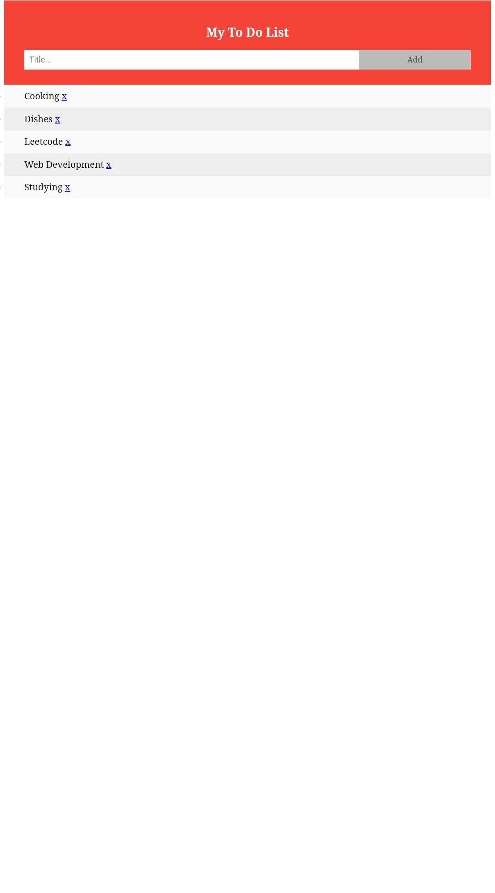

# 📝 To-Do List App  
### 🚀 LGMVIP Web Development Task – 1

A clean, responsive, and interactive **To-Do List** web app built using **HTML, CSS, and JavaScript**.  
Manage your daily tasks efficiently — add, complete, and delete with ease.

🌐 **Live Demo**: [Click to View App](https://nehaatomar.github.io/LGMVIP-Web-Task-Number-1/)

---

## 📸 Preview

  


---

## 🔥 Features

✅ Add new tasks instantly  
✅ Mark tasks as completed  
✅ Delete finished or unwanted tasks  
✅ Fully responsive design — mobile-friendly  
✅ Clean UI with simple UX

---

## 🛠️ Tech Stack

| HTML5 | CSS3 | JavaScript |
|:-----:|:----:|:----------:|
| 🧱    | 🎨   | ⚙️         |

---

## 🚀 Getting Started

Clone the project and run it locally:

```bash
git clone https://github.com/NehaaTomar/LGMVIP-Web-Task-Number-1.git
cd LGMVIP-Web-Task-Number-1
```

## 📬 Connect with Me

[](https://inspiring-palmier-dd7dd4.netlify.app/)
[](https://github.com/NehaaTomar)
[](https://www.linkedin.com/in/neha-tomar-52b212224)
[](mailto:nehatomar349@gmail.com)
